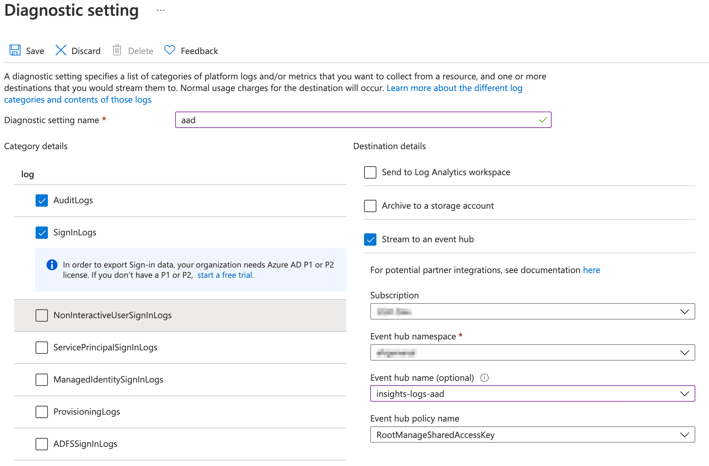

# Sending Azure Active Directory log data to an Event Hub

## Use a Diagnostic Setting to Send Logs to the Event Hub
* From the Azure Portal, select Azure Active Directory
* In the **Monitoring** section, select **Diagnostic settings**
* Choose an existing setting or create a new setting
* Give the diagnostic setting a name
* Select the events to log
  * Note: `NonInteractiveUserSignInLogs` and `ServicePrincipalSignInLogs` are higher volume data sources.
* Select "Stream to an event hub"
* Select your event hub details - default: `insights-logs-aad`
* Click the Save button

